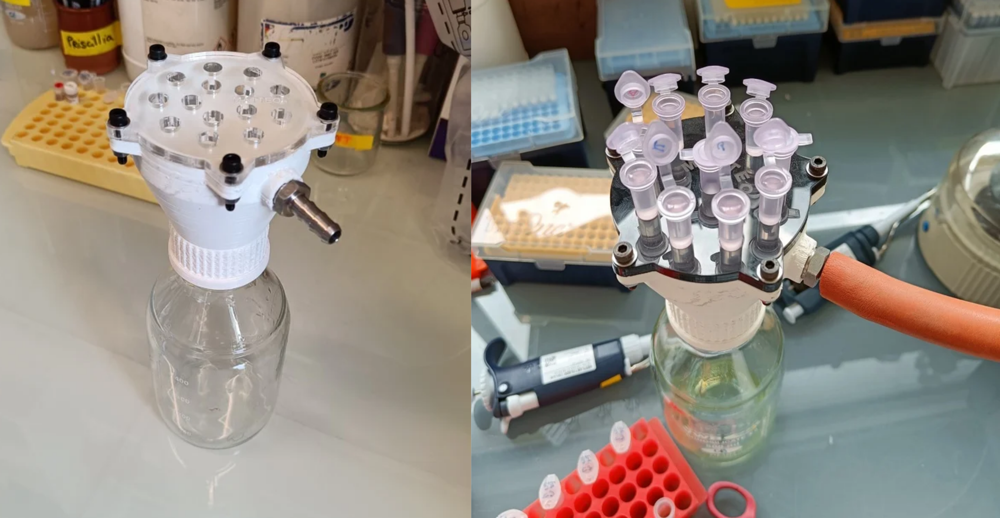

# Vacuum manifold for miniprep

  

## Description

Mini-prep, short for "mini-preparation," is a molecular biology technique used to extract and purify plasmid DNA from bacterial cells. In this method, bacterial cells are harvested, lysed, and the resulting lysate is loaded onto a specialized column filled with a resin that selectively binds DNA. After washing away impurities, the purified plasmid DNA is eluted from the column using a buffer. This column-based mini-prep is favored for its simplicity, speed, and high DNA purity, making it suitable for various downstream applications, such as cloning, sequencing, and gene analysis. The method can be performed using a centrifuge or vacuum manifolds to facilitate the flow of solutions through the specialized column.

The manifold has been designed to fit the Duran bottle system, allowing it to be placed over a Duran bottle to collect the flow-through in a safe and clean manner.

## Requirements

Material:

* 40mm rubber seal
* A-Lok/CPI Barbed Connector 6-6 B2HF-SS (e.g. https://valinonline.com/products/6-6-b2hf-ss)
* Rubber/silicon sheet (to create the gasket)
* M4x20 Bolts (5x)
* M4 nuts (5x)
* M4 Washers (10x)

Devices:
* 3D printer
* Laser Cutter/Engraver

## Printing and cutting

The manifold itself is designed for 3D printing, suitable for both FDM and SLA printers.The upper section of the manifold is intended to be cut from a 4mm or 5mm acrylic plate using a laser cutter/engraver, while the gasket should be cut from a rubber or silicone sheet.

## Assembly

The manifold and acrylic plate are assembled with a gasket placed between them to ensure a proper vacuum seal. Alternatively, vacuum silicone grease can be used instead of the gasket. Both parts are secured together using five M4x20 bolts. The manifold's vacuum outlet lacks threads. To attach it, warm up the A-Lok/CPI Barbed Connector and screw it into the hole. A 40mm rubber seal is employed to ensure a reliable seal between the bottle and the manifold.

## 3D models and laser cuttin files
Avalilable on Thingiverse at this [link](https://www.thingiverse.com/thing:6215450)

STL model

## Attribution and license
Minfold © 2023 by Matteo Scarsini is licensed under CC BY-NC-SA 4.0. To view a copy of this license, [visit creativecommons.org/licenses/by-nc-sa/4.0/](http://creativecommons.org/licenses/by-nc-sa/4.0/)

